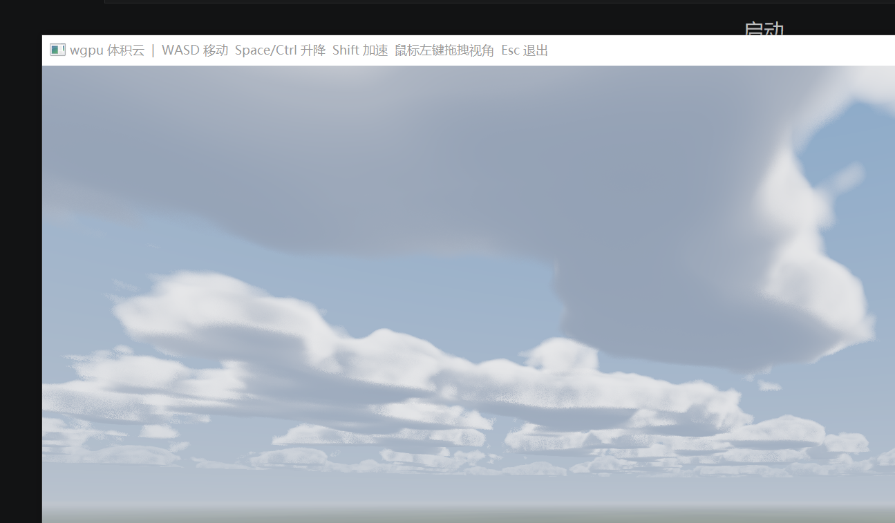

# test-wgpu — 体积云渲染 Demo

基于 **Rust + wgpu** 实现的实时体积云（Volumetric Clouds）效果。无任何贴图资源，云形、天空、地面全部由着色器程序化生成。



## 技术原理

整个效果在一个全屏三角形的片元着色器（`src/shader.wgsl`）中通过**光线步进（Raymarching）**完成：

1. **云层建模**：云位于 `CLOUD_BASE`（1500m）~ `CLOUD_TOP`（3600m）高度的平板区域内，视线与平板求交后在区间内做 80 步主步进
2. **云形密度**：5 个八度的 FBM 值噪声做基础形状 × 高度造型曲线（底平顶圆的积云轮廓）− 覆盖率阈值 − 高频噪声边缘侵蚀（保留云核、打碎边缘）
3. **光照与自阴影**：每个采样点向太阳方向做 5 步指数间距的光照步进，按 **Beer 定律**计算光学厚度衰减；附加多重散射近似，防止云底死黑
4. **银边效果**：**Henyey-Greenstein 相位函数**（前向散射 g=0.55 混合少量后向散射），逆光观察时云边缘发亮
5. **合成与抗条带**：能量守恒的前向积分，透射率低于阈值提前退出；步进起点加逐像素抖动消除分层条带；远处的云逐渐融入大气雾色
6. **背景**：程序化天空渐变 + 太阳日盘与光晕 + 带噪声变化的简单地面
7. **动态**：云随风向缓慢飘动（时间驱动噪声采样偏移）

CPU 侧（`src/main.rs`）使用 winit 0.30 + wgpu 26 搭建窗口与渲染管线，每帧仅更新一个 Uniform 缓冲（分辨率、时间、相机位姿、太阳方向）。

## 运行

```bash
cargo run
```

> 国内网络已在 `.cargo/config.toml` 中配置了项目级 rsproxy 镜像，不影响全局 cargo 配置。

### 操作方式

| 操作 | 按键 |
|---|---|
| 移动 | `W` `A` `S` `D` / 方向键 |
| 升降 | `Space` / 左 `Ctrl` |
| 加速 | 左 `Shift`（可以飞进云层内部） |
| 视角 | 鼠标左键拖拽 |
| 退出 | `Esc` |

## 参数调节

着色器顶部的常量均可直接修改（`src/shader.wgsl`）：

| 常量 | 作用 | 建议范围 |
|---|---|---|
| `COVERAGE` | 云覆盖率 | 0.48 偏晴朗 ~ 0.54 偏阴天 |
| `DENSITY` | 密度增益，越大云越厚实、边缘越清晰 | 1.5 ~ 3.0 |
| `CLOUD_BASE` / `CLOUD_TOP` | 云层底/顶高度（米） | — |
| `MARCH_STEPS` | 主步进次数，质量与性能的权衡 | 48 ~ 128 |
| `SIGMA` | 消光系数缩放 | 0.05 ~ 0.12 |

## 已知取舍

噪声为纯 ALU 实时计算（未预烘焙 3D 纹理），代码简单但片元开销较高。若高分辨率下帧率不足，可考虑：

- 将噪声烘焙到 3D 纹理后采样
- 降分辨率渲染云层再上采样合成

## 技术栈

| 依赖 | 版本 |
|---|---|
| wgpu | 26 |
| winit | 0.30 |
| pollster | 0.4 |
| bytemuck | 1 |

## 生成记录

- **生成工具**：Claude Code（Anthropic）
- **模型**：Fable 5（`claude-fable-5`，1M 上下文版本）
- **Effort 级别**：medium（推理强度，取自 Claude Code 全局设置 `effortLevel`）
- **生成时间**：2026-06-10
- **说明**：项目由 AI 从零创建，包括 Rust 框架代码、WGSL 着色器与参数调优，并通过自动运行 + 截图验证了渲染效果

### 详细耗时（依据文件时间戳还原）

总耗时约 **43 分钟**（2026-06-10 09:27 ~ 10:10），其中：

| 阶段 | 时间段 | 耗时 | 内容 |
|---|---|---|---|
| 代码编写 | 09:27 ~ 09:30 | ~3 min | 创建 Cargo.toml、main.rs（winit/wgpu 框架）、shader.wgsl（体积云着色器） |
| 网络问题处理 | 09:30 ~ 09:40 | ~10 min | crates.io 直连超时（SSL 失败），排查后配置项目级 rsproxy 镜像 |
| 依赖下载与首次编译 | 09:40 ~ 09:45 | ~5 min | 拉取 wgpu 全套依赖，完整编译 5m07s |
| 运行验证与调优 | 09:45 ~ 10:06 | ~21 min | 自动运行 + Win32 窗口截图验证；3 轮参数调优（密度增益、覆盖率 0.52→0.48→0.54→0.50），每轮增量编译约 2s |
| 实现总结输出 | 10:06 ~ 10:08 | ~2 min | 整理技术方案说明 |
| README 编写 | 10:09 ~ 10:10 | ~2 min | 本文档 |

> 备注：纯代码编写仅约 3 分钟；大部分时间花在网络问题、依赖编译和"运行→截图→调参"的视觉验证循环上。期间还遇到并解决了两个截图问题（窗口被浏览器遮挡、PowerShell 跨命令类型定义丢失）。
